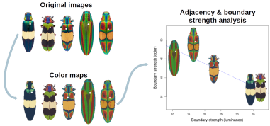

# recolorize v 0.1.0.9000 [](https://travis-ci.org/hiweller/recolorize)
#### Color-based image segmentation (for people with other things to do).



> Original image credit: Nathan P. Lord / Able Chow

* **Update, Dec. 2021**: recolorize is now [on CRAN](https://cran.r-project.org/web/packages/recolorize/index.html)!
* **Update, Sept. 2021**: A methods manuscript is in progress, but in the meantime, if you need to cite this package, please cite [this abstract](https://scholar.google.com/scholar?cluster=7568048124372269297&hl=en&oi=scholarr).

## What is this?

This is a package for making color maps, which are needed (or at least useful) for a wide range of color analysis techniques. It was born out of conversations with many biologists who found, to their surprise and mine, that generating color maps were the bottleneck step in their analyses. Fully automated methods rarely work all of the time, and are difficult to modify, while fully manual methods are subjective and time-consuming. This package tries to split the difference by giving you a mix of tools that will do a pretty good job with no user input, and then allow minor manual changes like merging and filtering layers or splitting components, before exporting them to the next step of your analysis. It's also, for the most part, totally deterministic – no arbitrary seed-setting for repeatability.

## Quick start

To generate the images above:
```{r}
# install the development version of the package:
devtools::install_github("hiweller/recolorize")

# alternatively, install the CRAN release by running: 
# install.packages("recolorize")

for (i in 1:length(images)) {
  
  # get an initial fit with generic clustering
  init_fit <- recolorize::recolorize(images[i], method = "hist", bins = 3)
  
  # cluster similar colors and fit again
  refined_fit <- recolorize::recluster(init_fit, similarity_cutoff = 60)
  
  # store in an output variable
  if (i == 1) {
    colormap_list <- list(refined_fit)
  } else {
    colormap_list[[i]] <- refined_fit
  }
}

lapply(colormap_list, function(i) plotImageArray(i$recolored_img))

```
See [package vignettes](https://cran.r-project.org/web/packages/recolorize/vignettes/Introduction.html) for detailed documentation.

## How does it work?

Recolorize is a toolbox of automatic, semi-automatic, and manual methods that aims to give you reproducible results that work pretty well out-of-box, and which are easy to tailor to your needs. The general workflow is an initial clustering step -> an automatic or semi-automatic reclustering step -> optional manual refinements -> export to another format, like an image, a set of binary masks, or another R package.

## Contact

Please do email me if this is something that may be relevant for you or if you have questions. Most of the features in the package are the result of feedback, and no method should be developed in a vacuum. If you include example images in your email, my likelihood of responding goes through the roof.

Email: hannahiweller@gmail.com
