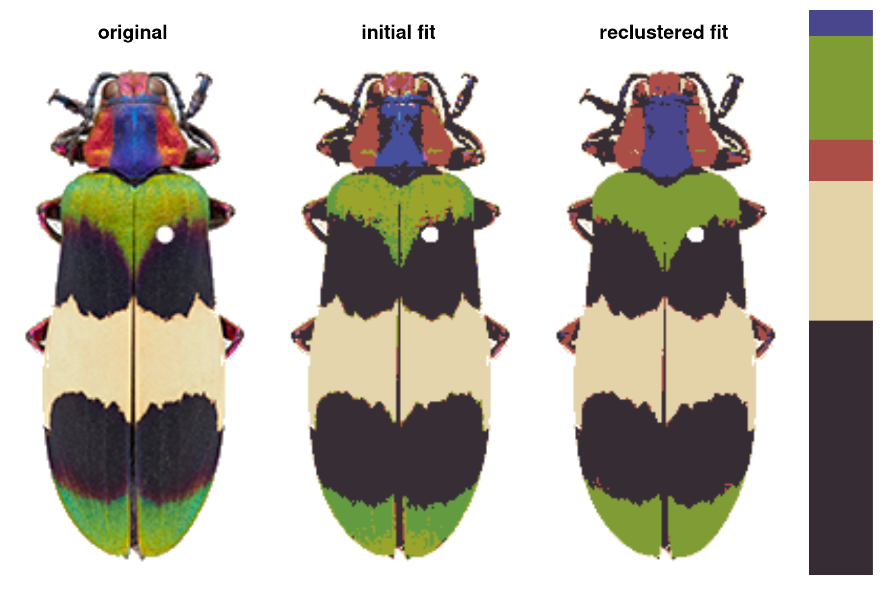
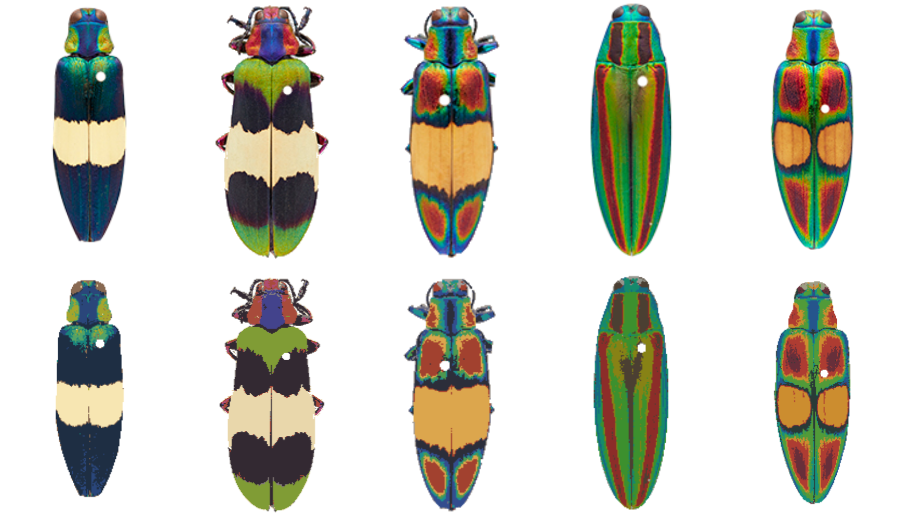

<!-- README.md is generated from README.Rmd. Please edit that file -->

# recolorize v0.1.0

<!-- badges: start -->

[](https://github.com/hiweller/recolorize/actions/workflows/R-CMD-check.yaml)
<!-- badges: end -->

#### Color-based image segmentation (for people with other things to do).


> Comparison of color maps produced using k-means clustering (center)
> vs. `recolorize` (right). Original image credits: Jack Randall, Nathan
> P. Lord, and Alison Davis-Rabosky.

-   **Update, Apr. 2022**: Please cite the
    [preprint](https://www.biorxiv.org/content/10.1101/2022.04.03.486906v1)
    if you’re using this package! (Also, please read the preprint.)
-   **Update, Dec. 2021**: recolorize is now [on
    CRAN](https://cran.r-project.org/web/packages/recolorize/index.html)!
-   **Update, Sept. 2021**: A methods manuscript is in progress, but in
    the meantime, if you need to cite this package, please cite [this
    abstract](https://scholar.google.com/scholar?cluster=7568048124372269297&hl=en&oi=scholarr).

## What is this?

This is a package for making color maps, which are needed (or at least
useful) for a wide range of color analysis techniques. It was born out
of conversations with many biologists who found, to their surprise and
mine, that generating color maps were the bottleneck step in their
analyses. Fully automated methods rarely work all of the time, and are
difficult to modify, while fully manual methods are subjective and
time-consuming. This package tries to split the difference by giving you
a mix of tools that will do a pretty good job with no user input, and
then allow minor manual changes like merging and filtering layers or
splitting components, before exporting them to the next step of your
analysis (e.g. [pavo](https://cran.r-project.org/package=pavo),
[patternize](https://cran.r-project.org/package=patternize)). It’s also,
for the most part, totally deterministic – no arbitrary seed-setting for
repeatability.

## Quick start

Install the package:

``` r
# development version:
install.packages("devtools")
devtools::install_github("hiweller/recolorize")

# OR
install.packages("recolorize") # CRAN release
```

To run `recolorize` on a single image:

``` r
library(recolorize)

# load an image that comes with the package:
img <- system.file("extdata/corbetti.png", package = "recolorize")
rc <- recolorize2(img, cutoff = 45)
```



A batch processing example:

``` r
# get list of all PNGs that come with the package:
images <- dir(system.file("extdata", package = "recolorize"),
             pattern = ".png", full.names = TRUE)

# for every image...
for (i in 1:length(images)) {

  # get an initial fit with generic clustering
  init_fit <- recolorize2(images[i], method = "hist", bins = 2, cutoff = 25, plotting = FALSE)

  # drop small patches
  refined_fit <- thresholdRecolor(init_fit, pct = 0.01, plotting = FALSE)

  # store in an output variable
  if (i == 1) {
    colormap_list <- list(refined_fit)
  } else {
    colormap_list[[i]] <- refined_fit
  }
}

# compare original to recolored images:
layout(matrix(1:10, nrow = 2, byrow = TRUE))
par(mar = rep(0, 4))
o <- lapply(colormap_list, function(i) plot(i$original_img))
r <- lapply(colormap_list, function(i) plotImageArray(recoloredImage(i)))
```



See [package
vignettes](https://cran.r-project.org/web/packages/recolorize/vignettes/Introduction.html)
for detailed documentation.

## How does it work?

Recolorize is a toolbox of automatic, semi-automatic, and manual methods
that aims to give you reproducible results that work pretty well
out-of-box, and which are easy to tailor to your needs. The general
workflow is an initial clustering step -\> an automatic or
semi-automatic reclustering step -\> optional manual refinements -\>
export to another format, like an image, a set of binary masks, or
another R package.

## Contact

Please do email me if this is something that may be relevant for you or
if you have questions. Most of the features in the package are the
result of feedback, and no method should be developed in a vacuum. If
you include example images in your email, my likelihood of responding
goes through the roof.

Email: <hannahiweller@gmail.com>
